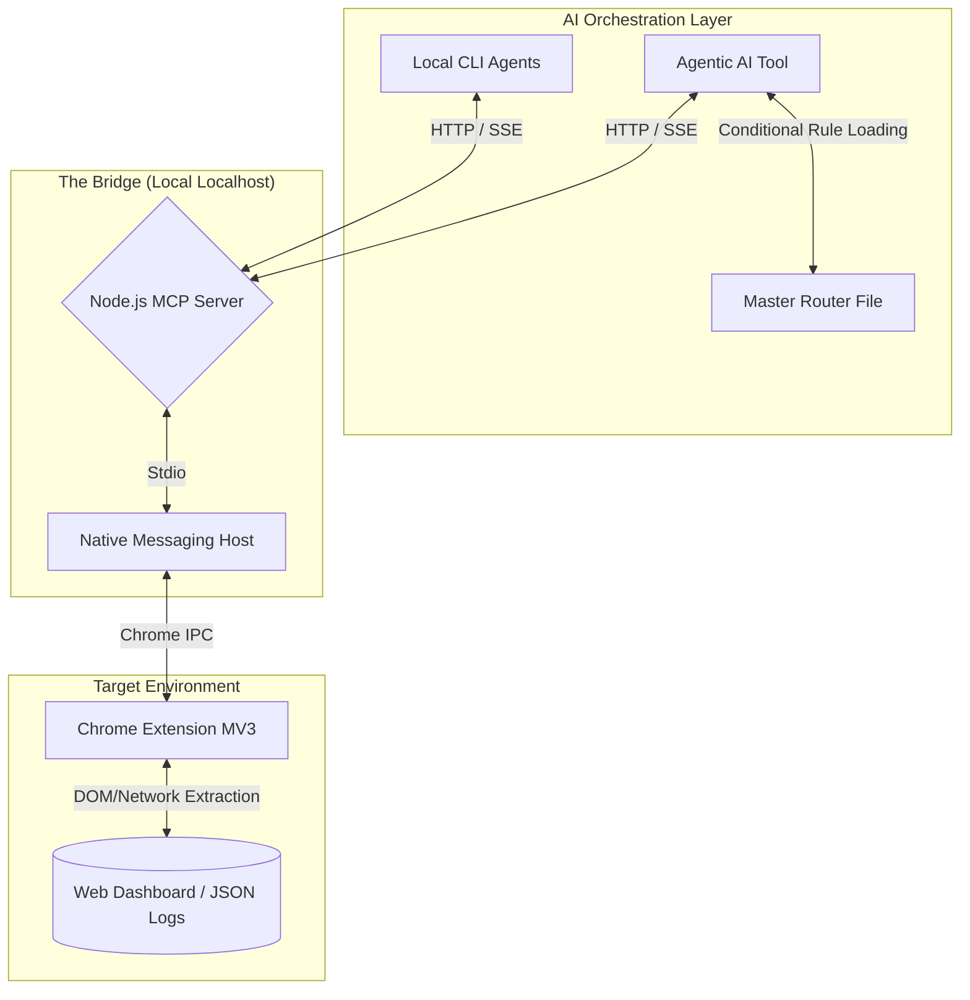

# 🌉 MCP Autonomous Agent Architecture (PoC)

A Proof-of-Concept (PoC) architecture demonstrating how to reduce Large Language Model (LLM) token consumption by over 90% using the **Model Context Protocol (MCP)**, Chrome Extensions (MV3), Native Messaging, and Conditional Context Routing.

## ⚠️ The Problem: The Cost of Raw Context

When building autonomous AI agents to analyze complex web dashboards and massive JSON logs, the standard approach is to feed raw data dumps directly into the LLM's context window. 

During stress tests, a single complex analysis loop was consuming up to **1.4 million tokens**. Every time the agent iterated on a diagnostic step, the massive payload remained in the context window, compounding the cost exponentially. Prompt engineering couldn't fix this; it required an infrastructure pivot.

## 🏗️ The Solution: A 3-Tier "Bridge" Architecture

Instead of eagerly loading context, I built an infrastructure that allows the AI to fetch exactly what it needs, exactly when it needs it, using MCP tools.

### Architecture Diagram

### Component Breakdown

1. **Data Extractor (Chrome Extension MV3):** 
   A sandboxed extension injected into the target web environment. It captures real-time page data, network requests, without relying on public APIs.
   
2. **Native Messaging Host:** 
   Acts as the secure, high-speed bridge between the browser environment and the local operating system.

3. **Node.js MCP Server:** 
   Exposes specific data-fetching tools (e.g., `fetch_context()`) to the LLMs. It receives the raw data from the browser, structures it, extracts only the key entities, and returns a clean, minified JSON to the LLM.

## 🚀 Key Engineering Challenges Solved

### 1. Token Reduction (1.4M -> 3k)
By shifting from "eager context loading" (pasting transcripts) to "lazy context fetching" (tool calling via MCP), the token footprint for a single complex diagnostic session dropped from ~1.4M tokens to roughly 3k tokens, maintaining 100% analytical accuracy.

### 2. The Concurrency Challenge (Stdio vs. HTTP)
Standard MCP servers use `stdio` transport, creating a 1:1 relationship (one dedicated process per client). However, my workflow required using multiple agentic AI tools in parallel. 

**The Fix:** I rewrote the MCP server transport layer, dropping `stdio` in favor of a `StreamableHTTPServerTransport` daemon with session management. Now, multiple AI tools receive unique session IDs but share the same underlying data buffer and browser state.

### 3. Lazy-Loading System Prompts & Rules
Beyond data ingestion, I optimized how the AI reads its own instructions. Eager-loading dozens of markdown files containing project rules and domain knowledge into every prompt was wasting baseline tokens. 

**The Fix:** I implemented a conditional routing system. A lightweight master file (like `CLAUDE.md`) acts as a router, instructing the agent: *"If the task involves X, read `rules/x.md` first. Otherwise, ignore it."* This ensures the agent only consumes tokens for the exact behavioral rules required for the current task.

## 🛠️ Tech Stack
* **AI/LLMs:** Claude Opus 4.6, Sonnet 4.6, Haiku 4.5, GPT 5.4 Medium/High, Gemini 3.1 Pro, OpenRouter with Qwen3.6 Plus and Gemma 4, Local Models (Qwen and Gemma variants).
* **Protocols:** Model Context Protocol (MCP)
* **Backend:** Node.js, TypeScript
* **Browser:** Chrome Extension API (Manifest V3), Native Messaging

---
*Note: This repository contains the architectural blueprint and documentation for this PoC. Source code is kept private due to personal data structures used in the testing environments.*
