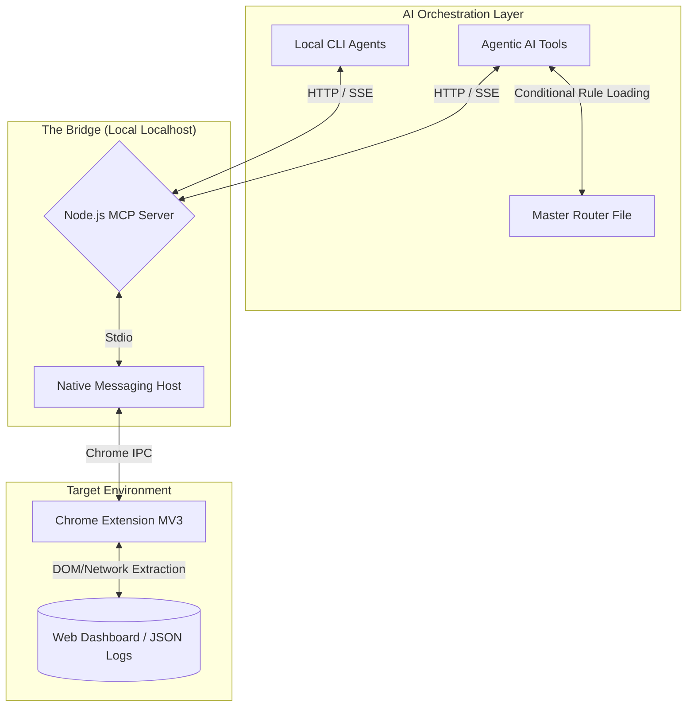

# 🌉 MCP Autonomous Agent Architecture (PoC)

I’ve been spending my free time exploring the limits of autonomous AI agents and MCPs. I was building a Proof-of-Concept agent designed to analyze massive JSON log files and dashboards.

The code worked nicely, but I hit a wall REAL quick: The API bill 🥹

I was doing some stress tests, a single complex analysis loop was burning through **1.4 million tokens**. That definitely isn't right for a single turn. If I ever wanted to scale this architecture, this token consumption would be unsustainable long-term.

Here is how I audited, redesigned the architecture, and dropped the context cost by over 90%.

## 🔍 Finding the Bottleneck

So, before optimizing prompts blindly, I created a structured analysis framework. I was running a multi-agent setup (using multiple agentic AI tools and local CLI tools).

The analysis revealed that the problem wasn't my system prompts. The problem was the data ingestion workflow (input I provided).

I was feeding an entire raw data dump (often 900+ lines of text and logs) directly into the LLM's context window 🤭 Every time the agent iterated on a step, that massive amount of data remained in the context window, adding up exponentially at each turn to a huge final cost.

## 🏗️ Building "The Bridge"

Prompt engineering wouldn't fix this 😂 I needed an architectural change, totally different approach.

So, instead of manually feeding data to the LLM, I built a 3-tier MCP architecture:

1. **Data Extractor (Chrome Extension MV3):** A sandbox extension to capture real-time data.
2. **Native Messaging Host:** Acting as the secure bridge between the browser and local processes.
3. **Node.js MCP Server:** Connecting tools to the LLMs.

**The Impact:** Before the MCP Bridge, I was passing massive raw text blocks (costing ~50k-100k tokens per loop). With Bridge, the AI simply calls a tool: `fetch_context()`. The MCP server fetches the data, extracts only important entities, and returns a clean, structured JSON to the LLM.

The new cost? Roughly 3k tokens for the exact same analytical context. Crazy right?

## ⚡ The Concurrency Challenge: Stdio vs. HTTP

Once the Bridge was live, I hit a new architectural wall. Standard MCP servers use `stdio` transport (one dedicated process per client). But like I mentioned I like experimenting a lot of different AI tools in parallel.

**The Solution:** I rewrote the MCP server to drop `stdio` in favor of a `StreamableHTTPServerTransport` daemon with session management. Now, multiple AI tools receive unique session IDs but share the same underlying data buffer. I can finally use the MCP server across all my tools and it's a relief.

## 🔀 The System Prompt Problem: Lazy-Loading Context

Beyond data ingestion, I noticed another huge token leak: my own system instructions. 

I had dozens of markdown files containing specific behavioral rules and domain knowledge. Initially, I was eager-loading all of these files into the LLM's context for every single prompt. If I asked a simple question, the agent was still reading the rules for complex server SSH access 🤦‍♂️

**The Solution:** I implemented a conditional routing system. I created a lightweight master instruction file (like `CLAUDE.md` or `GEMINI.md`) that acts as a router. It explicitly instructs the agent: *"If the task involves X, read `rules/x.md` first. Otherwise, ignore it."* 

This "lazy loading" of system prompts ensured the agent only consumed tokens for the exact behavioral rules required for the current task.

## 💡 Core Takeaways for AI Engineers

* **Architectural optimization beats prompt optimization.** Building the MCP Bridge saved infinitely more tokens than tweaking system instructions or miraculous and fancy rules ever could. I see projects with SO MANY rules that could end up causing confusion for most models lower than Opus 4.6 Thinking MAX. I'm talking about hundreds of rules. That's insane.
* **Measure before you cut.** The 1.4 million token metric forced me to make hard architectural decisions. I screwed up when planning the architecture. But lesson learned. MCPs all the way now.

If you are building autonomous agents, stop pasting raw context and BE CAREFUL with having your whole project folder as context. Remember to use `.*ignore` files and only call certain files conditionally via ruling in files like `CLAUDE.md`, `GEMINI.md`, etc. Build the infrastructure to let your agents fetch exactly what they need, exactly when they need it.

---
*Note: This repository contains the architectural blueprint and documentation for this PoC. Source code is kept private due to personal data structures used in the testing environments.*
